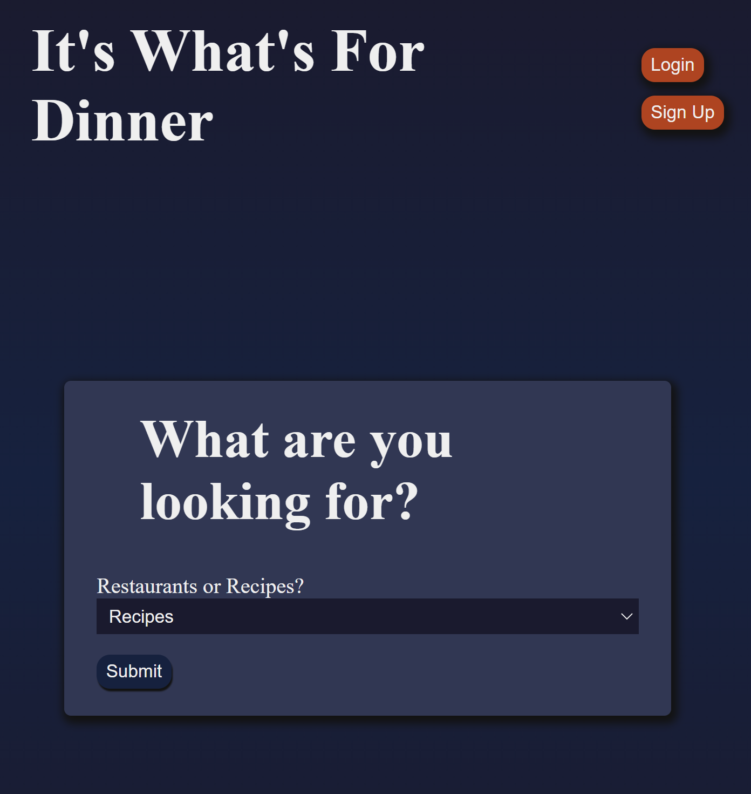
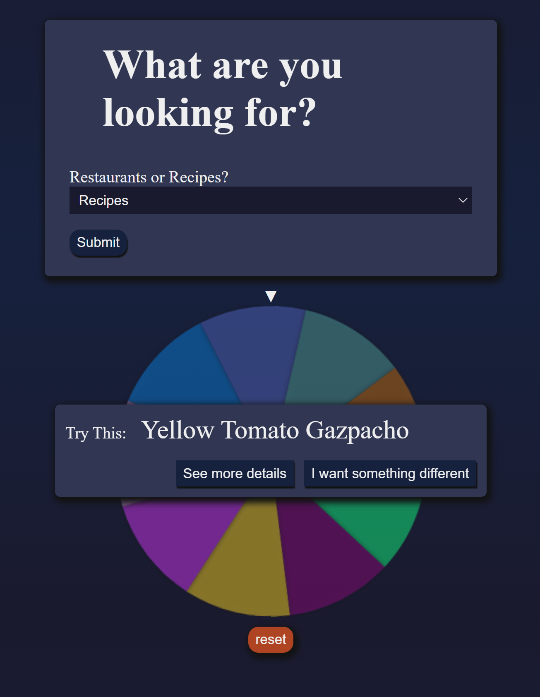

# What's For Dinner

Helps users choose what to do for dinner with the help of a fun spinning wheel

Thinkful first solo capstone project

### Live link is [here](https://whats-for-dinner-client.vercel.app/)

### Stack Used: HTML, CSS, JavaScript React, Node.js, Express, PostgreSQL

In the future, I would like to add api for food delivery service with affiliate links and monetize with ads. I would also like to use an api to help users find restaurants that are near them so the results will be based on an input of their zip code.

A user can sign up and login. They can choose between restaurants and recipes, spin a wheel, and get a result about what they should do for dinner. As an authenticated user they can add their own restaurants/recipes and favorites. 

### ScreenShots

### Deploying

When your new project is ready for deployment, add a new Heroku application with `heroku create`. This will make a new git remote called "heroku" and you can then `npm run deploy` which will push to this remote's main branch.

### Deployment

This section has moved here: [https://facebook.github.io/create-react-app/docs/deployment](https://facebook.github.io/create-react-app/docs/deployment)

### `npm run build` fails to minify

This section has moved here: [https://facebook.github.io/create-react-app/docs/troubleshooting#npm-run-build-fails-to-minify](https://facebook.github.io/create-react-app/docs/troubleshooting#npm-run-build-fails-to-minify)
